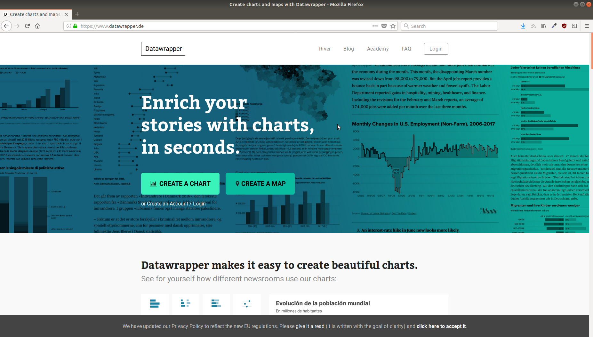

# Une brève introduction à la visualisation de données

## Introduction

> The simple graph has brought more information to the data analyst’s mind than any other device.

— John Tukey

## Au programme

* Un peu d'histoire
* Quelques principes
* 4 + 1 outils

# Un peu d'histoire

## { .fullpage }

## { .fullpage }

## { .fullpage }

## { .fullpage }

## { .fullpage }

## { .fullpage }

## { .fullpage }

# Choisir son graphique

## { .fullpage }

# 4 + 1 outils

## { .fullpage }

## { .fullpage }

## { .fullpage }

## { .fullpage }

## Kepler.gl

* [Visualiser ses trajets Trainline](https://twitter.com/AntoineAugusti/status/1048600809091596293) par Antoine Augusti

## { .fullpage }

## Pour aller plus loin 

* Edward Tufte, *The Visual Display of Quantitative Information*
* [The FT Visual Vocabulary](http://ft-interactive.github.io/visual-vocabulary/)
* [Information is Beautiful Awards](https://www.informationisbeautifulawards.com/)
* [The Upshot 1st birthday](https://www.nytimes.com/interactive/2015/04/22/upshot/happy-birthday-upshot.html)
* [Pudding.cool](https://pudding.cool/)
* [Chartbuilder](https://quartz.github.io/Chartbuilder/)

<!--
https://i1.wp.com/askmedia.fr/blog/wp-content/uploads/2014/10/3413SEM-Data-Retraites.jpg
https://i1.wp.com/askmedia.fr/blog/wp-content/uploads/2014/10/3911SEM-Data-Les-produits.jpg
https://i1.wp.com/askmedia.fr/blog/wp-content/uploads/2014/02/datamatch_depensespubliques.jpg
https://askmedia.fr/blog/vu-sur-le-web-combien-dimpots-payent-effectivement-les-compagnies-americaines/
-->
