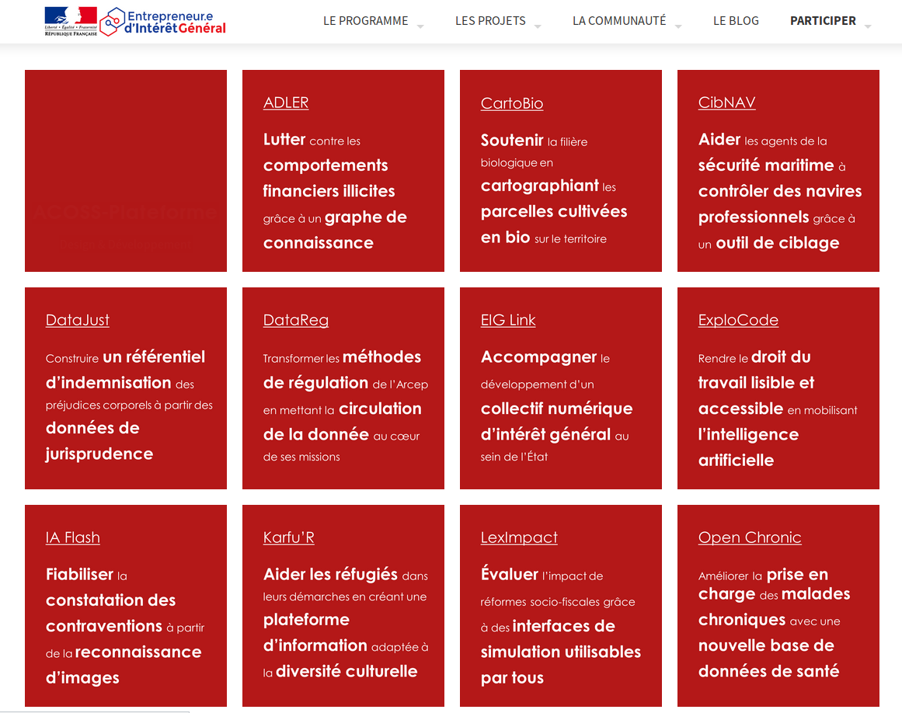

# France data policy

### Etalab

> Mission statement : Contribute to the digital transformation of public action through data

### { .fullpage }

### 3 axes for data policy

* producing high quality key datasets
* improving data flow while respecting confidentiality
* using data to improve public action

### 3 levels of action

1. **maker way** : develop products and tools
2. **legal way** : drafting the law, defining a policy
3. **people way** : supporting public administration and working with the civil society

### Producing high quality key datasets

Giving legal recognition to « reference data » (Digital Republic Act, 2016)

9 key datasets that are critical for the society and economy, including :

* Company Register (Sirene),
* Land Register (Cadastre),
* National adresses database,
* National directory of associations

### { .fullpage }

### Improving data flow

#### Legal way

* _Free access to public data has now become the rule_. Exceptions to this principle are now very strictly regulated.
* The Digital Republic Act (2016) has considerably expanded the range of administrative documents available online, moving from release on demand to _open data by default_ (effective in 2018)

#### Maker way

* Designing and implementing tools (platforms, API, …) to improve data flow

### { .fullpage }

### { .fullpage }

### using data to improve public action

### { .fullpage }

### { .fullpage }

### { .fullpage }

### Data science workflow

1. discussion with government agencies
2. get datasets (csv), look at them
3. try a very simple algorithm, it may make the job
4. show predictions to potential users
5. iterate

### { .fullpage }

### { .fullpage }

### See more

#### Twitter : https://twitter/etalab

#### Blog Etalab : https://www.etalab.gouv.fr/
